# ORB-SLAM3 Monocular Visual-Only Tracking

This document describes the monocular visual-only tracking pipeline in ORB-SLAM3, covering
initialization, frame-to-frame tracking, local map refinement, and keyframe management.

---

## High-Level Overview

Monocular tracking is the most challenging configuration because no depth information is
available from a single image. The system must bootstrap a 3D map from two-view geometry,
resolve **scale ambiguity** at initialization, and then maintain a consistent metric-scaled
map through careful keyframe selection and local bundle adjustment.

The pipeline has two distinct phases:

1. **Initialization** — establishes the first two keyframes and a sparse 3D map via two-view geometry
2. **Steady-state tracking** — tracks every incoming frame against the live 3D map

---

## Full Pipeline Diagram

```mermaid
flowchart TD
    A([New Monocular Frame]) --> B

    %% ─── FRAME PREPROCESSING ───────────────────────────────────────────────
    subgraph FP["① Frame Preprocessing"]
        B["ORB Feature Extraction<br/>(mpIniORBextractor during init:<br/>~2× more features than normal)"]
        B --> C["Build BoW Vector<br/>(DBoW2 vocabulary lookup:<br/>assign features to visual words)"]
        C --> D["Assign Features to Grid<br/>(64×48 image grid for fast<br/>neighbourhood lookups)"]
    end

    D --> E{Tracking<br/>State?}

    %% ─── INITIALIZATION ──────────────────────────────────────────────────
    E -->|NOT_INITIALIZED| INIT

    subgraph INIT["② Monocular Initialization  (Two-View Geometry)"]
        direction TB
        I1["Stage 1 – Collect Reference Frame<br/>Wait for frame with ≥100 keypoints.<br/>Store as mInitialFrame.<br/>Set mbReadyToInitializate = true"]
        I1 --> I2["Stage 2 – Feature Matching<br/>SearchForInitialization():<br/>• Window search (100 px) at scale level 0<br/>• ORB descriptor distance (Hamming)<br/>• Ratio test (NN ratio = 0.9)<br/>• Rotation histogram consistency check<br/>→ Requires ≥100 symmetric matches"]
        I2 --> I3["Two-View Geometry<br/>Camera::ReconstructWithTwoViews():<br/>• Estimate Fundamental/Essential matrix<br/>  (RANSAC 8-point algorithm)<br/>• Recover rotation R, translation t<br/>• Chirality check to select correct solution<br/>→ Camera pose of 2nd frame relative to 1st"]
        I3 --> I4["Triangulation<br/>Linear triangulation (DLT) for all<br/>inlier feature matches<br/>→ Initial sparse 3D point cloud<br/>  (scale-ambiguous, up-to-scale)"]
        I4 --> I5["CreateInitialMapMonocular()<br/>• Create 2 KeyFrames (KFini, KFcur)<br/>• Create MapPoints from triangulated pts<br/>• Add cross-observations to both KFs<br/>• Compute descriptors, normals, scale levels"]
        I5 --> I6["Global Bundle Adjustment<br/>Optimizer::GlobalBundleAdjustment()<br/>20 iterations on both KFs and all MPs<br/>→ Jointly refines poses + 3D positions"]
        I6 --> I7["Scale Normalisation<br/>Median depth of MPs → scale s = 1/median_depth<br/>(IMU-Mono: s = 4/median_depth)<br/>Apply s to both poses and all 3D points<br/>→ Map now has unit median scene depth"]
        I7 --> I8{"Valid?<br/>≥50 tracked MPs<br/>median depth > 0"}
        I8 -->|No – reset| I1
        I8 -->|Yes| OK
    end

    %% ─── STEADY-STATE TRACKING ──────────────────────────────────────────
    E -->|OK| T0

    subgraph TRACK["③ Steady-State Tracking"]
        direction TB
        T0["CheckReplacedInLastFrame()<br/>Replace any MapPoints that LocalMapping<br/>marked as bad with their substitute MPs"]

        T0 --> T1{Velocity<br/>model valid?}

        subgraph MM["③-a  Motion-Model Tracking<br/>(frame-to-frame, constant velocity)"]
            direction TB
            MM1["Predict Pose<br/>Tcw_predicted = mVelocity × Tcw_lastFrame<br/>(constant velocity assumption)"]
            MM1 --> MM2["Project Last-Frame MPs into Current Frame<br/>SearchByProjection(CurrentFrame, LastFrame,<br/>  th=30 px, mono=true)<br/>• Reproject each MP using predicted pose<br/>• Search within 30 px radius (×1.5 on retry)<br/>• ORB descriptor match + ratio test (0.9)<br/>→ Seed correspondences for pose opt."]
            MM2 --> MM3["Pose Optimisation<br/>Optimizer::PoseOptimization()<br/>• Solve PnP with inlier MPs via g2o<br/>• Huber robust kernel to down-weight outliers<br/>• 4 iterations with outlier removal<br/>→ Refined camera pose"]
            MM3 --> MM4{"≥10 inlier<br/>map points?"}
            MM4 -->|Yes| TLM
            MM4 -->|No – fall back| BOW
        end

        subgraph BOW["③-b  Reference-KeyFrame Tracking<br/>(BoW appearance matching)"]
            direction TB
            B1["Compute Current Frame BoW<br/>(if not already computed)"]
            B1 --> B2["BoW Feature Matching<br/>SearchByBoW(mpReferenceKF, CurrentFrame)<br/>• Match features sharing the same<br/>  vocabulary tree node (fast pruning)<br/>• ORB descriptor distance, ratio test (0.7)<br/>• Rotation histogram outlier rejection<br/>→ 2D–3D correspondences to reference KF MPs"]
            B2 --> B3["Pose Optimisation<br/>Optimizer::PoseOptimization()<br/>Same PnP solver as motion model path<br/>→ Refined camera pose"]
            B3 --> B4{"≥10 inlier<br/>map points?"}
            B4 -->|No| LOST
            B4 -->|Yes| TLM
        end

        T1 -->|Yes| MM1
        T1 -->|No| B1
    end

    %% ─── LOCAL MAP TRACKING ──────────────────────────────────────────────
    subgraph LMT["④ Local Map Tracking  (pose refinement with full local context)"]
        direction TB
        TLM["UpdateLocalKeyFrames()<br/>• Gather all KFs sharing ≥1 MP with current frame<br/>• Add their 10 best covisible neighbours<br/>• Add essential-graph parents/children<br/>→ Local keyframe set (≤80 KFs)"]
        TLM --> TLM2["UpdateLocalPoints()<br/>Collect all MPs observed by local KFs<br/>that are not yet matched in current frame<br/>→ Local map point set (thousands of MPs)"]
        TLM2 --> TLM3["SearchLocalPoints()<br/>For each local MP:<br/>  • Project into current frame using refined pose<br/>  • Check viewing angle ≤60° to MP normal<br/>  • Check distance within scale invariance range<br/>  • Search in projected neighbourhood (th=3–5 px)<br/>  • ORB descriptor match<br/>→ Hundreds of additional 2D–3D matches"]
        TLM3 --> TLM4["Final Pose Optimisation<br/>Optimizer::PoseOptimization()<br/>Now with all matched local MPs<br/>→ Accurate camera pose"]
        TLM4 --> TLM5{"≥30 inlier<br/>map points?"}
        TLM5 -->|No| LOST
        TLM5 -->|Yes| VEL
    end

    %% ─── VELOCITY UPDATE + OUTCOMES ─────────────────────────────────────
    VEL["Update Motion Model<br/>mVelocity = Tcw_current × Tcw_last⁻¹<br/>(stored for next frame's prediction)"]
    VEL --> KFD

    subgraph KFD["⑤ Keyframe Decision"]
        direction TB
        KF1["NeedNewKeyFrame()?<br/>• MaxFrames exceeded since last KF<br/>• Tracking quality weak:<br/>  inliers &lt; 0.9 × reference KF inliers<br/>• MinFrames elapsed AND local mapper idle<br/>• Too few 'close' (depth &lt; mThDepth) points<br/>  with many unmatched close features"]
        KF1 -->|Yes| KF2
        KF1 -->|No| DONE

        KF2["CreateNewKeyFrame()<br/>• Wrap current frame as KeyFrame<br/>• Link prev/next KF pointers<br/>• Insert into Atlas<br/>• Queue for LocalMapping thread:<br/>  → triangulates new MPs with neighbours<br/>  → refines covisibility graph<br/>  → runs local BA"]
    end

    DONE(["Pose Output<br/>Tcw stored in Frame;<br/>Trajectory logger updated"])
    KF2 --> DONE

    LOST(["LOST<br/>Attempt Relocalization:<br/>BoW place recognition against all KFs<br/>→ PnP + RANSAC to recover pose<br/>Reset if repeated failure"])

    OK(["State = OK<br/>Start Steady-State Tracking"])
    OK --> T0
```

---

## Block-by-Block Explanation

### ① Frame Preprocessing

| Step | What happens | Key concept |
|------|-------------|-------------|
| **ORB Extraction** | Detect FAST corners at 8 scale levels (factor 1.2), compute 256-bit BRIEF descriptors. During init an extended extractor (`mpIniORBextractor`) is used with ~2× more features to maximise match coverage. | Scale-space pyramid, oriented FAST + rotated BRIEF (ORB) |
| **BoW Vector** | Each descriptor is mapped to a leaf node in the DBoW2 vocabulary tree, producing a sparse TF-IDF weighted bag-of-words vector. | Inverted-index place recognition |
| **Feature Grid** | Features are binned into a 64×48 cell grid over the image. Grid cells allow O(1) neighbourhood queries used in projection-based search. | Spatial hashing |

---

### ② Monocular Initialization

The core challenge: a single image has no depth. The system uses two consecutive frames to recover
a **up-to-scale** relative pose and triangulate the first map points.

| Step | What happens | Key concept |
|------|-------------|-------------|
| **Reference Frame Collection** | Wait until a frame has ≥100 keypoints (the minimum for reliable two-view geometry). Store it and flag `mbReadyToInitializate`. | Minimum-feature gating |
| **Feature Matching** | `SearchForInitialization` searches a 100 px window around each feature in the reference frame, applies ratio test (0.9) and rotation consistency to keep only reliable matches. Scale level 0 only — finest scale = best accuracy. | Nearest-neighbour ratio test, rotation histogram |
| **Two-View Geometry** | `Camera::ReconstructWithTwoViews` runs RANSAC over the Essential matrix (calibrated camera) or Fundamental matrix (uncalibrated). The best decomposition (R, t) passes a chirality test (points must be in front of both cameras). | 5-point / 8-point algorithm, RANSAC, Essential matrix |
| **Triangulation** | DLT triangulation for every inlier match. Points behind either camera or with large reprojection error are discarded. | Linear triangulation (DLT) |
| **Map Creation** | Two `KeyFrame` objects and associated `MapPoint` objects are inserted into the Atlas. Cross-observations are recorded so covisibility graph edges are formed. | SLAM map, covisibility graph |
| **Global BA** | 20-iteration Levenberg-Marquardt BA over just 2 KFs and their MPs. Minimises reprojection error jointly. | Bundle Adjustment (g2o) |
| **Scale Normalisation** | Divide all poses and 3D coordinates by the median depth so the reconstructed scene has unit median depth (~1 m). This fixes the ambiguous scale factor. | Scale ambiguity resolution |

---

### ③-a Motion-Model Tracking

Used every frame once a velocity estimate exists (i.e., from the second frame after init).

| Step | What happens | Key concept |
|------|-------------|-------------|
| **Pose Prediction** | Multiply last pose by the stored velocity twist: `T_pred = V × T_last`. Assumes the camera moves with constant velocity between frames. | Constant-velocity motion model |
| **Projection-Based Search** | Each MapPoint visible in the last frame is projected using the **predicted** pose. ORB features within a 30 px reprojection radius are matched by descriptor distance + ratio test. | Reprojection-based windowed search |
| **PnP Pose Optimisation** | g2o minimises the 2D reprojection error of matched MPs with a Huber kernel. Iterative outlier removal tightens the inlier set. | Perspective-n-Point, robust optimisation |

**Why this works:** The constant-velocity assumption is valid for small inter-frame motion. Projecting known 3D points gives tight search windows (30 px) instead of searching the whole image, making matching fast and robust.

---

### ③-b BoW Reference-KeyFrame Tracking

Fallback when no velocity (e.g., first tracked frame after init or after recovery from a near-loss).

| Step | What happens | Key concept |
|------|-------------|-------------|
| **BoW Matching** | `SearchByBoW` iterates over vocabulary nodes shared between the reference keyframe and current frame. Only features mapped to the **same node** are compared — this limits the search to semantically similar regions. Ratio test is 0.7 (stricter than MM). | Bag-of-Words matching, inverted index |
| **Pose Optimisation** | Identical PnP solver as the MM path. | PnP |

**Why this works:** BoW matching is appearance-based and independent of any pose prediction, making it robust to sudden motion, vibration, or camera idle periods.

---

### ④ Local Map Tracking

After a coarse pose estimate from ③, the system refines it using the **entire local neighbourhood** of the map.

| Step | What happens | Key concept |
|------|-------------|-------------|
| **Local Keyframe Update** | Collect all KFs that share at least one MP with the current frame, plus their 10 best covisible neighbours and essential-graph parents/children (cap: 80 KFs). | Covisibility graph |
| **Local Point Update** | Union of all MPs seen by local KFs not yet matched in this frame. Typically thousands of candidate points. | Local map |
| **SearchLocalPoints** | Each candidate MP is projected using the current (coarse) pose. Only points within ≤60° of the MP's viewing direction and inside the scale-invariance distance range are searched. Matching radius is just 3–5 px — very tight because pose is already approximately known. | Guided projection search, scale-invariance |
| **Final PnP** | Full PnP optimisation over all newly matched local MPs. Produces the final accurate pose. | Bundle Adjustment-lite |

**Why this matters:** Motion-model tracking only sees MPs from the *last* frame (~100 pts).
Local map tracking adds MPs from *dozens* of nearby KFs (~1000+ pts), dramatically increasing
accuracy and robustness to partial occlusion.

---

### ⑤ Keyframe Decision

A new keyframe is created when tracking quality starts to degrade or new scene content appears.

| Condition | Rationale |
|-----------|-----------|
| **MaxFrames elapsed** | Hard upper bound — ensures map freshness even in static scenes |
| **Inliers < 0.9 × ref-KF inliers** | Tracking is weakening — must anchor the map before pose estimation drifts |
| **Local mapper idle + MinFrames elapsed** | Opportunistic insertion when the back-end can process the new KF without delay |
| **Few close points** | Many features are within `mThDepth` but unmatched — unexplored geometry nearby |

Monocular keyframe ratio threshold is **0.9** (stricter than stereo's 0.75) because monocular
tracking degrades faster — no depth anchor means fewer redundant observations.

---

## Key Data Structures

| Structure | Role |
|-----------|------|
| `Frame` | Single image snapshot: ORB features, BoW vector, grid index, pose |
| `KeyFrame` | Selected Frame promoted to the map — has persistent observations and graph edges |
| `MapPoint` | 3D point with descriptor, normal, scale bounds, observation list |
| `Atlas` | Container for active map + all frozen sub-maps |
| `mVelocity` | SE(3) twist between last two frames — the motion model |
| `mpReferenceKF` | The KF most covisible with the current frame — BoW tracking anchor |

---

## Relocalization (Recovery from LOST)

When `TrackLocalMap` fails (< 30 inliers), the system enters `LOST`:

1. **Place Recognition** — BoW vector of current frame is queried against the database of all KFs
2. **Candidate KFs** — top-N visually similar KFs are retrieved
3. **PnP + RANSAC** — for each candidate, EPnP + RANSAC estimates a pose from BoW-matched MPs
4. **Optimise** — if enough inliers, run PnP optimisation and return to OK state

Relocalization requires **no motion prior** — it works purely on appearance.
