# ORB-SLAM3 Stereo Visual-Only Tracking

This document describes the stereo visual-only tracking pipeline in ORB-SLAM3.
Stereo differs from monocular primarily in initialization (single frame, metric scale from baseline)
and in how new map points are created (via stereo disparity instead of multi-frame triangulation).

---

## High-Level Overview

With a calibrated stereo rig the system immediately knows the **metric scale** of the scene from
the camera baseline. This has several advantages over monocular:

- Initialization from a **single frame** — no two-view geometry bootstrap required
- Every keyframe can create new map points with known depth via **stereo disparity**
- Smaller feature-search radii (7 px vs 30 px) because metric depth constrains reprojection tightly
- Relaxed keyframe ratio threshold (0.75 vs 0.9) because depth anchor reduces drift

The pipeline is otherwise identical to monocular after initialization: the same motion-model,
BoW, and local-map tracking stages are reused.

---

## Full Pipeline Diagram

```mermaid
flowchart TD
    A([New Stereo Frame\nleft + right images]) --> B

    %% ─── FRAME PREPROCESSING ───────────────────────────────────────────────
    subgraph FP["① Frame Preprocessing  (stereo-specific)"]
        B["Parallel ORB Extraction\nLeft image  → mpORBextractorLeft\nRight image → mpORBextractorRight\n(run in separate threads for speed)"]
        B --> C["Stereo Feature Matching\nFrame::ComputeStereoMatches()\n• Match left↔right ORB descriptors\n• Enforce epipolar constraint: same row ±2 px\n• Sub-pixel disparity refinement (SAD window)\n• Depth = mBF / disparity  (mBF = baseline × fx)\n→ Each matched left feature gets a right u-coord\n  and a metric depth value"]
        C --> D["BoW Vector + Feature Grid\n(same as monocular)"]
    end

    D --> E{Tracking\nState?}

    %% ─── INITIALIZATION ──────────────────────────────────────────────────
    E -->|NOT_INITIALIZED| INIT

    subgraph INIT["② Stereo Initialization  (single-frame, metric)"]
        direction TB
        I1["Prerequisite Check\n≥500 ORB keypoints in left image\n(mStereoInitMinKeypoints)"]
        I1 --> I2["Set Origin Pose\nFirst frame placed at world origin:\nTcw = Identity\n(no two-view geometry needed)"]
        I2 --> I3["Unproject Stereo Features → 3D\nFor each left feature with valid disparity:\n  X = (u − cx) × depth / fx\n  Y = (v − cy) × depth / fy\n  Z = depth\n→ Immediate metric 3D positions\n  (no scale ambiguity)"]
        I3 --> I4["Create Initial KeyFrame\nWrap current frame as KFini\nInsert into Atlas"]
        I4 --> I5["Create MapPoints\nFor each valid 3D point:\n  • Create MapPoint at (X,Y,Z)\n  • Add left + right observations to KFini\n  • Compute representative descriptor\n  • Compute mean viewing direction\n  • Set scale invariance distances\n→ Hundreds of MPs immediately available"]
        I5 --> I6["Covisibility Graph Initialised\nKFini is the sole vertex;\nedges added as new KFs arrive"]
        I6 --> OK
    end

    OK(["State = OK\nStart Steady-State Tracking"])
    OK --> T0

    %% ─── STEADY-STATE TRACKING ──────────────────────────────────────────
    E -->|OK| T0

    subgraph TRACK["③ Steady-State Tracking"]
        direction TB
        T0["CheckReplacedInLastFrame()\nSwap any bad/merged MPs with\ntheir valid replacements from LocalMapping"]

        T0 --> T1{Velocity\nmodel valid?}

        subgraph MM["③-a  Motion-Model Tracking\n(frame-to-frame, constant velocity)"]
            direction TB
            MM1["Predict Pose\nTcw_pred = mVelocity × Tcw_last\n(constant-velocity SE(3) integration)"]
            MM1 --> MM2["Project Last-Frame MPs → Current Frame\nSearchByProjection(CurrentFrame, LastFrame,\n  th=7 px, mono=false)\n• Reproject each MP with predicted pose\n• Search in 7 px radius (tight: metric depth known)\n• Descriptor match + ratio test (0.9)\n• Widen to 14 px if < mMotionModelMinInitialMatches\n→ Seed correspondences for pose opt."]
            MM2 --> MM3["Pose Optimisation\nOptimizer::PoseOptimization()\n• g2o PnP, Huber kernel\n• 4 iterations with outlier pruning\n→ Refined Tcw"]
            MM3 --> MM4{"≥10 inlier\nmap points?"}
            MM4 -->|Yes| TLM
            MM4 -->|No – fall back| BOW
        end

        subgraph BOW["③-b  Reference-KeyFrame Tracking\n(BoW appearance matching)"]
            direction TB
            B1["Compute BoW for Current Frame\n(if not yet done)"]
            B1 --> B2["BoW Feature Matching\nSearchByBoW(mpReferenceKF, CurrentFrame)\n• Match features in same vocabulary node\n• ORB descriptor distance, ratio test (0.7)\n• Rotation-histogram outlier rejection\n→ 2D–3D correspondences via reference KF MPs"]
            B2 --> B3["Pose Optimisation\nOptimizer::PoseOptimization()\n→ Refined Tcw"]
            B3 --> B4{"≥10 inlier\nmap points?"}
            B4 -->|No| LOST
            B4 -->|Yes| TLM
        end

        T1 -->|Yes| MM1
        T1 -->|No| B1
    end

    %% ─── LOCAL MAP TRACKING ──────────────────────────────────────────────
    subgraph LMT["④ Local Map Tracking  (full local-context refinement)"]
        direction TB
        TLM["UpdateLocalKeyFrames()\n• All KFs sharing ≥1 MP with current frame\n• Their 10 best covisible neighbours\n• Essential-graph parents/children\n→ Local KF set (≤80 KFs)"]
        TLM --> TLM2["UpdateLocalPoints()\nAll MPs seen by local KFs\nnot yet matched in this frame\n→ Candidate local-map point set"]
        TLM2 --> TLM3["SearchLocalPoints()\nFor each candidate MP:\n  • Project with current (coarse) pose\n  • Reject if viewing angle > 60° to MP normal\n  • Reject if outside scale-invariance range\n  • Search in tight 3–5 px window\n  • ORB descriptor match\n→ Many additional 2D–3D matches"]
        TLM3 --> TLM4["Final Pose Optimisation\nOptimizer::PoseOptimization()\nOver all matched local MPs\n→ Accurate final Tcw"]
        TLM4 --> TLM5{"≥30 inlier\nmap points?"}
        TLM5 -->|No| LOST
        TLM5 -->|Yes| VEL
    end

    %% ─── VELOCITY UPDATE + KEYFRAME ─────────────────────────────────────
    VEL["Update Motion Model\nmVelocity = Tcw_current × Tcw_last⁻¹"]
    VEL --> KFD

    subgraph KFD["⑤ Keyframe Decision  (stereo thresholds)"]
        direction TB
        KF1["NeedNewKeyFrame()?\n• MaxFrames elapsed since last KF\n• Many KFs in map:  inliers < 0.75 × ref-KF inliers\n  Few KFs in map:   inliers < 0.9  × ref-KF inliers\n• Weak tracking:   inliers < 0.80 × ref-KF inliers\n  AND close-point condition met\n• Local mapper idle + MinFrames elapsed\n• Too few tracked close points\n  (depth < mThDepth, baseline-relative)"]
        KF1 -->|Yes| KF2
        KF1 -->|No| DONE

        KF2["CreateNewKeyFrame()\n• Wrap current frame as new KF\n• Link prev/next KF pointers\n• Insert into Atlas\n• Create stereo MapPoints for\n  unmatched features with valid depth:\n    depth < mThDepth → 'close' (reliable)\n    depth ≥ mThDepth → 'far' (skip for now)\n  Limit to ~100 closest new MPs\n• Queue KF for LocalMapping:\n  → BoW, covisibility edges\n  → Triangulate with neighbours\n  → Local Bundle Adjustment"]
    end

    DONE(["Pose Output\nTcw stored; trajectory updated"])
    KF2 --> DONE

    LOST(["LOST\nRelocalization:\nBoW query → candidate KFs\n→ EPnP + RANSAC per candidate\n→ PnP optimise if ≥10 inliers\n→ Return to OK or reset map"])
```

---

## Block-by-Block Explanation

### ① Frame Preprocessing — Stereo-Specific Steps

| Step | What happens | Key concept |
|------|-------------|-------------|
| **Parallel ORB Extraction** | Left and right images are processed simultaneously in separate threads. Each produces FAST keypoints at 8 scale levels (factor 1.2) with 256-bit BRIEF descriptors. | Multi-threaded extraction |
| **Stereo Feature Matching** | `ComputeStereoMatches()` enforces the **epipolar constraint**: matched features must lie on the same image row (±2 px rectification tolerance). A block-matching SAD window refines disparity to sub-pixel accuracy. Depth = `mBF / disparity` where `mBF = baseline × fx`. | Epipolar geometry, SAD block matching, sub-pixel disparity |
| **Depth Classification** | Points with `depth < mThDepth` (baseline × `thDepth` parameter, typically ~40 baseline lengths) are "close" — treated as reliable stereo observations that need only one KF. Farther points are treated like monocular — they need triangulation across multiple KFs. | Close/far point separation |

---

### ② Stereo Initialization

Unlike monocular, stereo initialization **does not need two frames**. The very first frame
immediately produces a metric map.

| Step | What happens | Key concept |
|------|-------------|-------------|
| **Single-Frame Bootstrap** | Only the number of keypoints is checked (≥500). No motion required. | Stereo depth = no motion bootstrap |
| **Origin Placement** | First frame's pose is set to identity. All future poses are expressed relative to this origin. | Map anchoring |
| **Metric 3D Unprojection** | `Frame::UnprojectStereo(i)` uses the calibrated stereo depth (not estimated) to get exact metric 3D coordinates. Scale is determined by the physical baseline. | Metric reconstruction |
| **MapPoint Creation** | Hundreds of MPs are created in a single frame. Both left and right feature observations are stored, improving descriptor quality and normal estimation. | Binocular observation |

**Contrast with monocular:** Monocular init needs ≥100 matches across two frames, runs RANSAC,
triangulates, runs global BA, and then normalises scale. Stereo skips all of this — a single frame
with stereo disparity gives a ready-to-use metric map.

---

### ③-a Motion-Model Tracking

Stereo motion-model tracking is identical in structure to monocular but uses **tighter search windows**
because metric depth is known.

| Parameter | Stereo | Monocular | Reason |
|-----------|--------|-----------|--------|
| Initial search radius | **7 px** | 30 px | Metric depth → tighter reprojection prediction |
| Retry search radius | **14 px** | 60 px | Same ratio |
| NN ratio test | 0.9 | 0.9 | Same |
| Min inliers for success | 10 | 10 | Same |

**Why smaller search radius?** In stereo, depth is known from disparity, so the predicted 2D
reprojection of a 3D point is already very accurate even with a coarse pose. In monocular, depth
is estimated from triangulation which accumulates more uncertainty.

---

### ③-b Reference-KeyFrame BoW Tracking

Identical to monocular. Used when velocity is unavailable or motion model tracking falls below
threshold. BoW matching is pose-free and acts as an appearance-based anchor.

---

### ④ Local Map Tracking

Identical algorithm to monocular. Local KFs → local MPs → guided projection search → final PnP.

The threshold for success is the same (**30 inliers**) but in practice stereo tracking reaches
this threshold more easily because:
- More MPs are created per KF (stereo depth available for every feature with disparity)
- Tighter projection search → fewer false matches → cleaner inlier set

---

### ⑤ Keyframe Decision — Stereo-Specific Thresholds

Stereo is **less conservative** about keyframe insertion than monocular because depth information
makes each new KF's map points more reliable.

| Condition | Stereo threshold | Mono threshold | Rationale |
|-----------|-----------------|---------------|-----------|
| **Inlier ratio (many KFs)** | 0.75 | 0.9 | Stereo MPs are more stable — can tolerate more tracking loss |
| **Inlier ratio (few KFs)** | 0.90 | 0.9 | Same when map is sparse |
| **Weak-tracking override** | 0.80 AND close-point check | N/A | Extra stereo-specific condition |

**Close-point check:** When few close-range MPs (depth < `mThDepth`) are tracked but many stereo
features in the current frame could generate new close-range MPs, a new KF is inserted immediately
regardless of the inlier ratio. This prevents tracking degradation near objects.

**New MPs in CreateNewKeyFrame:** For each left feature with valid disparity and `depth < mThDepth`:
1. A new MapPoint is created at the stereo-measured 3D position
2. It is added to the map even if the feature was not matched to any existing MP
3. Up to ~100 of the closest unmatched points are added per KF

This is the main source of new map geometry in stereo mode (vs. triangulation-from-multiple-KFs
in monocular LocalMapping).

---

## Stereo vs Monocular Comparison

| Aspect | Stereo | Monocular |
|--------|--------|-----------|
| **Initialization** | Single frame, metric scale | Two frames, RANSAC + BA + scale normalisation |
| **Minimum keypoints for init** | 500 | 100 (frame) + ≥100 matches |
| **Scale** | Metric (from baseline) | Up-to-scale (requires external normalisation) |
| **Map point creation** | Single KF with disparity | Triangulation across ≥2 KFs |
| **Close points** | Stereo MPs (1 KF sufficient) | All points need ≥2 KF observations |
| **Motion model search radius** | 7 px (tight) | 30 px (loose) |
| **KF inlier ratio (normal)** | 0.75 | 0.9 |
| **Depth accuracy** | Metric, degrades with distance | Relative, degrades with baseline/depth ratio |
| **Far-point handling** | Falls back to mono triangulation | Only mode available |
| **Robustness to rotation** | High (many MPs from disparity) | Lower (depends on scene depth) |

---

## Key Data Structures (Stereo-Specific)

| Field | Type | Role |
|-------|------|------|
| `Frame::mvuRight` | `vector<float>` | Right-image u-coordinate for each left feature (−1 if unmatched) |
| `Frame::mvDepth` | `vector<float>` | Metric depth for each left feature (−1 if stereo unmatched) |
| `mBF` | `float` | baseline × fx — converts disparity to depth |
| `mThDepth` | `float` | Close/far threshold in metres |
| `MapPoint::mbStereoClose` | `bool` | Was this MP created from a close stereo observation? |

---

## Relocalization (Recovery from LOST)

Stereo relocalization follows the same BoW → candidate KF → EPnP + RANSAC path as monocular.
Because stereo provides depth for matched features, the PnP solver gets 3D→3D correspondences
rather than estimated-depth 3D→2D, which makes RANSAC faster and more reliable.
